# Quantum Circuit Simulation Outputs

Figures and terminal text grouped by script.

Figures are stored in `quantam-circuit-simulation-figures/`.

## Perceval CNOT Gate.py

### Terminal Output

```text
<perceval.rendering.canvas.mplot_canvas.MplotCanvas object at 0x00000254D833FE90>
<perceval.rendering.canvas.mplot_canvas.MplotCanvas object at 0x00000254D837F650>
```

### Figures


*Figure 1. CNOT Photonic Processor*

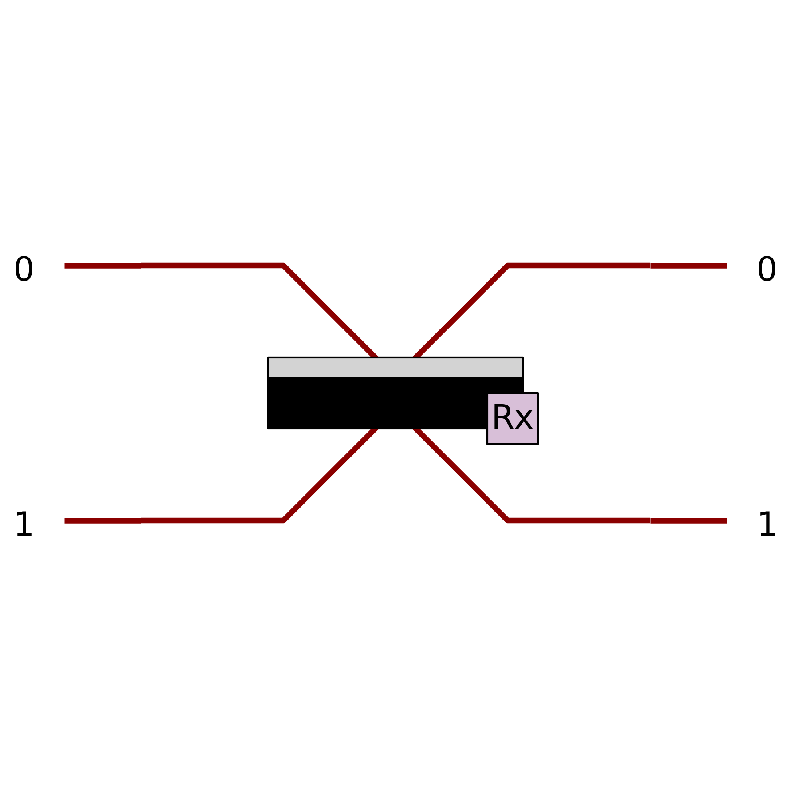

*Figure 2. Displayed Figure 01*


*Figure 3. Displayed Figure 02*

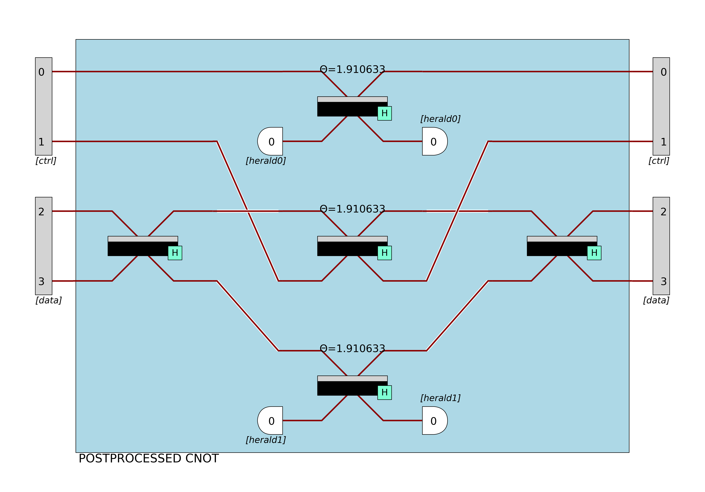

*Figure 4. Displayed Figure 03*


*Figure 5. Displayed Figure 04*


*Figure 6. HOM Optical Circuit*

## Perceval HOM Effect.py

### Terminal Output

```text
Perceval Photonic Circuit:
<perceval.components.linear_circuit.Circuit object at 0x0000028AFFF60F50>

Input State:
|1,1>

Output Probability Distribution:
|2,0>: 0.5000
|0,2>: 0.5000
```

*No figure files were generated for this script.*

## Perceval Large Interferometer.py

### Terminal Output

```text
Large 8-mode Photonic Interferometer:
<perceval.rendering.canvas.mplot_canvas.MplotCanvas object at 0x000002E7C87B3310>

Input State:
|1,1,1,1,0,0,0,0>

Number of output states:
183

Top Output States:
|2,1,1,0,0,0,0,0>: 0.0817
|3,0,1,0,0,0,0,0>: 0.0466
|1,0,2,0,1,0,0,0>: 0.0412
|0,2,1,0,1,0,0,0>: 0.0381
|0,1,1,1,1,0,0,0>: 0.0374
|1,1,0,0,2,0,0,0>: 0.0362
|1,0,1,0,2,0,0,0>: 0.0362
|2,0,1,0,1,0,0,0>: 0.0309
|2,2,0,0,0,0,0,0>: 0.0293
|1,2,0,0,1,0,0,0>: 0.0262
|0,2,1,1,0,0,0,0>: 0.0256
|1,0,1,0,1,1,0,0>: 0.0236
|1,0,1,0,1,0,1,0>: 0.0236
|1,1,2,0,0,0,0,0>: 0.0234
|0,3,1,0,0,0,0,0>: 0.0233
```

### Figures

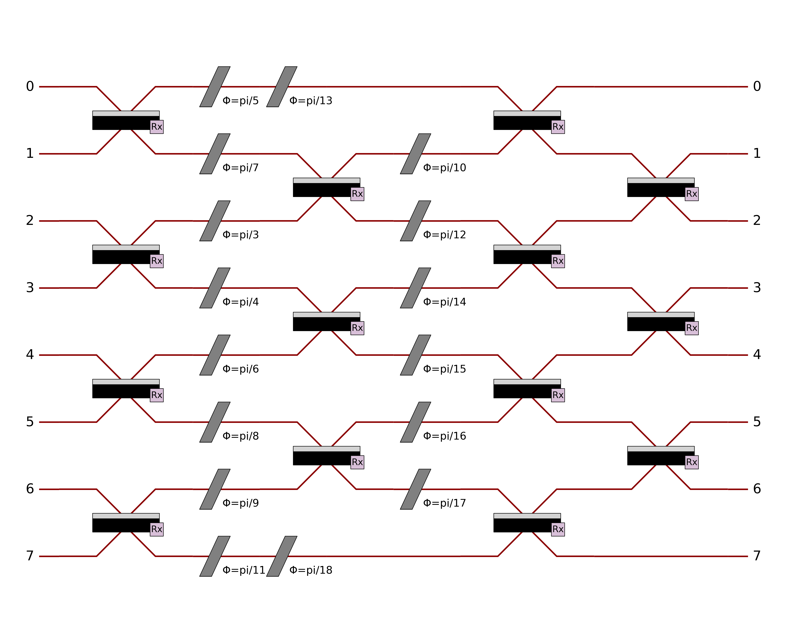

*Figure 7. Displayed Figure 01*


*Figure 8. Displayed Figure 02*

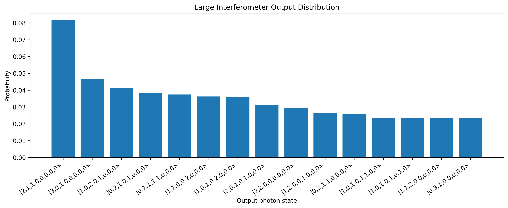

*Figure 9. Displayed Figure 03*


*Figure 10. Large Interferometer Circuit*

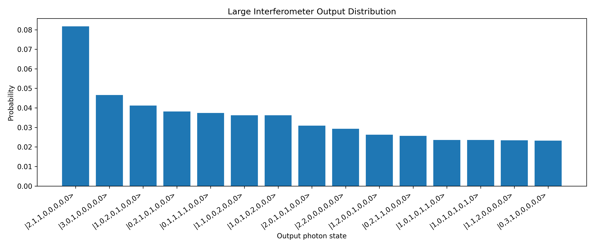

*Figure 11. Large Interferometer Distribution*

## Perceval Mini Boson Sampling.py

### Terminal Output

```text
Mini Boson-Sampling Circuit:
<perceval.rendering.canvas.mplot_canvas.MplotCanvas object at 0x00000199F26C6E50>

Input State:
|1,1,1,0,0,0>

Top Output States:
|1,1,0,1,0,0>: 0.1177
|1,2,0,0,0,0>: 0.0947
|2,1,0,0,0,0>: 0.0947
|1,1,0,0,1,0>: 0.0683
|1,1,0,0,0,1>: 0.0683
|2,0,0,1,0,0>: 0.0645
|0,2,0,1,0,0>: 0.0645
|0,0,1,2,0,0>: 0.0617
|0,0,0,3,0,0>: 0.0461
|1,1,1,0,0,0>: 0.0385
```

### Figures

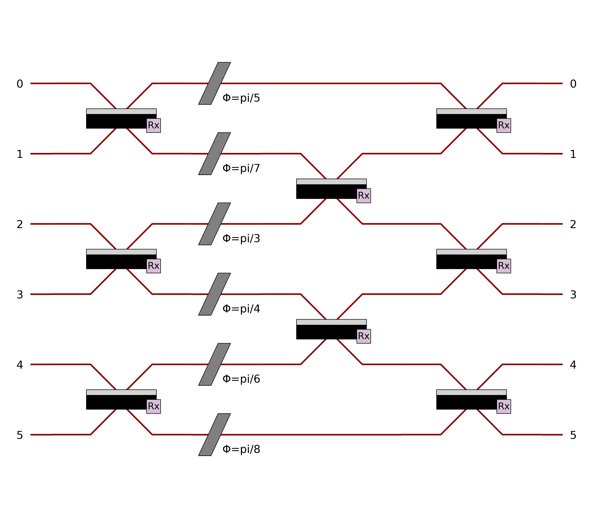

*Figure 12. Displayed Figure 01*


*Figure 13. Displayed Figure 02*

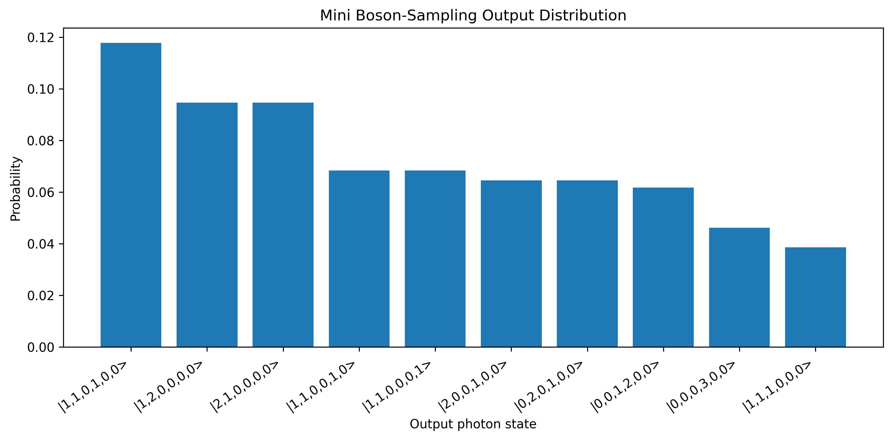

*Figure 14. Displayed Figure 03*


*Figure 15. Mini Boson Sampling Circuit*

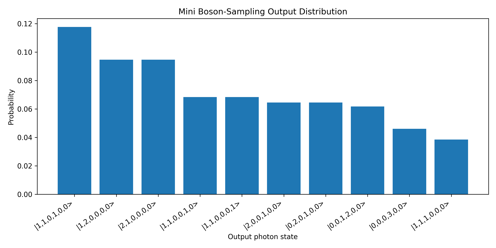

*Figure 16. Mini Boson Sampling Distribution*

## Perceval Photonic Teleportation.py

### Terminal Output

```text
Alice's original qubit to teleport:
0.707*|1,0>+0.707*|0,1>

Shared Bell state between Alice and Bob:
0.707*|1,0,1,0>+0.707*|0,1,0,1>

Full teleportation output:
{'results': {
	|1,0,0,1,1,0>: 0.12499999999999999
	|1,0,1,0,1,0>: 0.12499999999999999
	|1,0,1,0,0,1>: 0.12500000000000003
	|0,1,1,0,1,0>: 0.12499999999999999
	|0,1,1,0,0,1>: 0.12500000000000003
	|1,0,0,1,0,1>: 0.12500000000000003
	|0,1,0,1,1,0>: 0.12499999999999999
	|0,1,0,1,0,1>: 0.12500000000000003
}, 'global_perf': 0.11111111111111115}

Bob's final qubit distribution after teleportation:
|1,0>: 0.5000
|0,1>: 0.5000

Global success probability:
0.11111111111111115

Photonic teleportation processor:
<perceval.rendering.canvas.mplot_canvas.MplotCanvas object at 0x000001F6C66A0F90>
```

### Figures


*Figure 17. Displayed Figure 01*


*Figure 18. Displayed Figure 02*

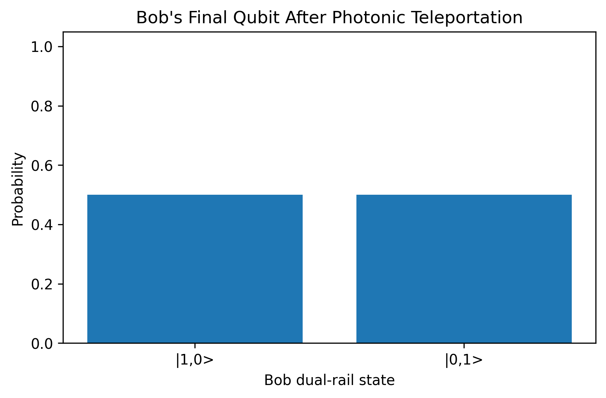

*Figure 19. Displayed Figure 03*

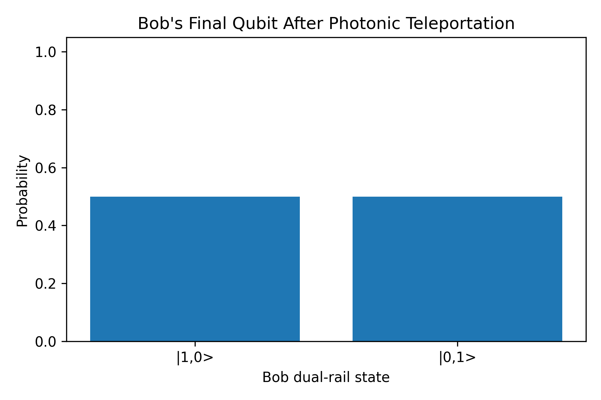

*Figure 20. Photonic Teleportation Bob Distribution*


*Figure 21. Photonic Teleportation Processor*

## Qiskit Bell State.py

### Terminal Output

```text
Qiskit Bell-State Circuit:
     ┌───┐     ┌─┐   
q_0: ┤ H ├──■──┤M├───
     └───┘┌─┴─┐└╥┘┌─┐
q_1: ─────┤ X ├─╫─┤M├
          └───┘ ║ └╥┘
c: 2/═══════════╩══╩═
                0  1 

Measurement Results:
{'11': 532, '00': 492}
```

### Figures

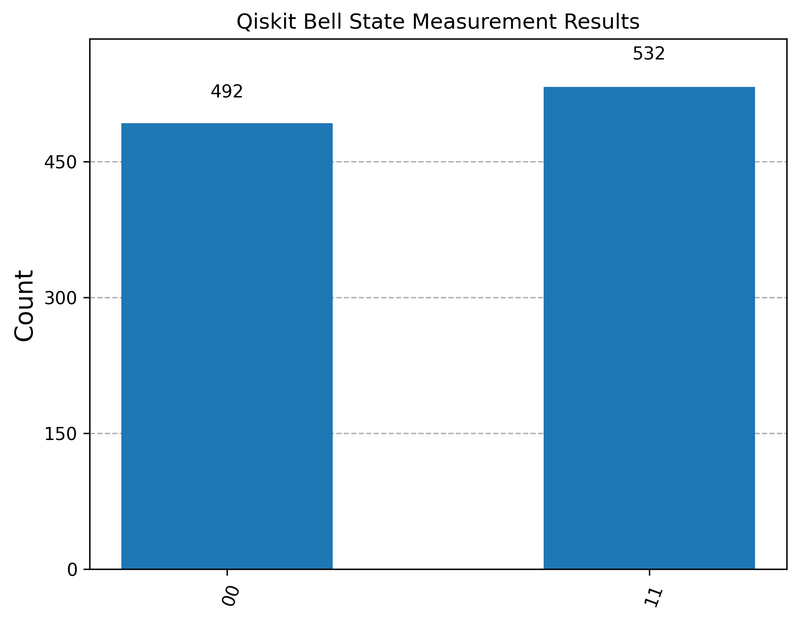

*Figure 22. Displayed Figure 01*

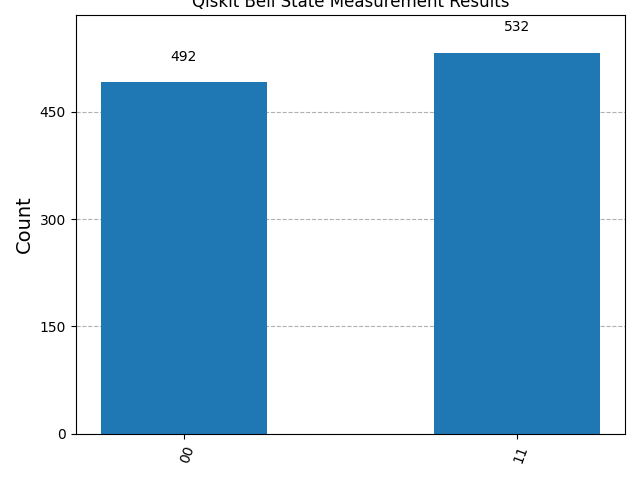

*Figure 23. Qiskit Bell State Results*

## Qiskit Quantum Teleportation.py

### Terminal Output

```text
Quantum Teleportation Circuit:
     ┌───┐ ░            ░      ┌───┐ ░ ┌─┐    ░            
q_0: ┤ H ├─░────────────░───■──┤ H ├─░─┤M├────░───────■────
     └───┘ ░ ┌───┐      ░ ┌─┴─┐└───┘ ░ └╥┘┌─┐ ░       │    
q_1: ──────░─┤ H ├──■───░─┤ X ├──────░──╫─┤M├─░───■───┼────
           ░ └───┘┌─┴─┐ ░ └───┘      ░  ║ └╥┘ ░ ┌─┴─┐ │ ┌─┐
q_2: ──────░──────┤ X ├─░────────────░──╫──╫──░─┤ X ├─■─┤M├
           ░      └───┘ ░            ░  ║  ║  ░ └───┘   └╥┘
c: 3/═══════════════════════════════════╩══╩═════════════╩═
                                        0  1             2 

Measurement Results:
{'100': 128, '011': 136, '111': 141, '110': 144, '101': 129, '001': 114, '000': 118, '010': 114}
```

### Figures

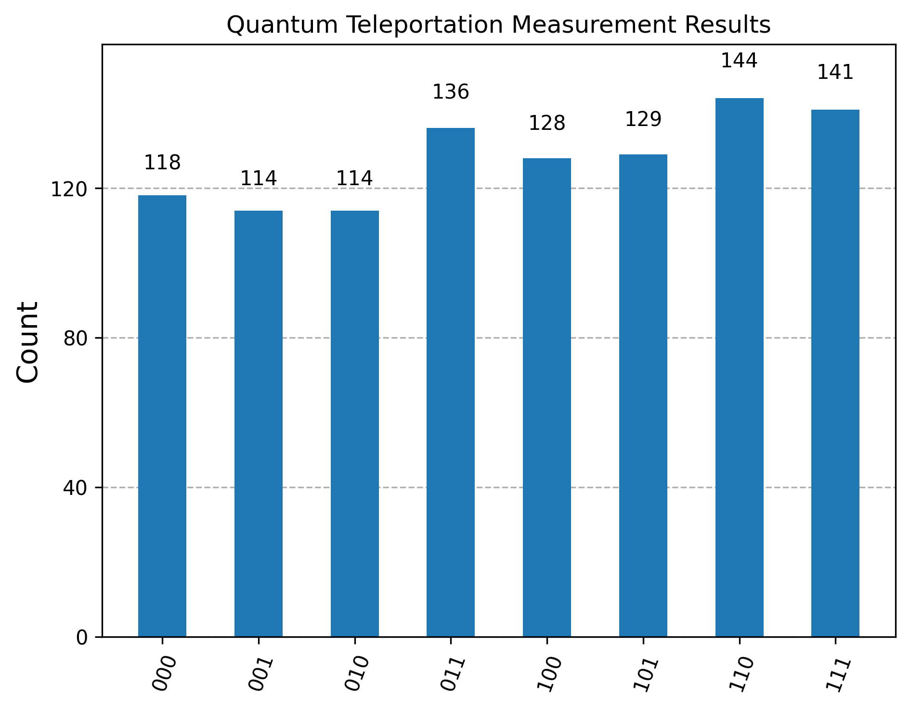

*Figure 24. Displayed Figure 01*

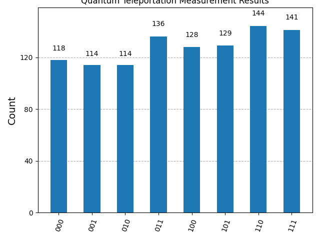

*Figure 25. Quantum Teleportation Results*
